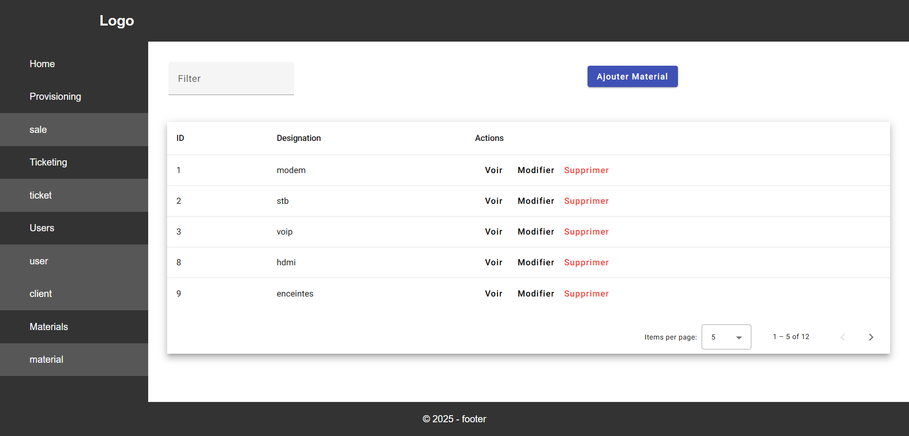

# CRUD Docker Laravel Angular

Simple CRUD avec API Laravel 10 et front-end Angular 19 et MySQL et phpMyAdmin sous Docker.


## Prérequis
- Docker
- Docker Compose


## Installation

- Construction du projet :
```bash
git clone https://github.com/ghyslain12/laravel-docker-apache-angular.git
sudo chmod -R 777 laravel-docker-apache-angular/
cd laravel-docker-apache-angular
docker-compose up --build -d
docker exec -it laravel_app sh -c "composer install"
```

## Utilisation docker

- Monter le conteneur :
```bash
docker-compose up
```
- Démonter le conteneur :
```bash
docker-compose down
```


## Services
- Angular (front-end): http://localhost:4200/
- Laravel (API): http://localhost:8741


## API
- User: http://localhost:8741/api/utilisateur
- Client: http://localhost:8741/api/client
- Material: http://localhost:8741/api/material
- Ticket: http://localhost:8741/api/ticket
- Sale: http://localhost:8741/api/sale


## Aperçu



